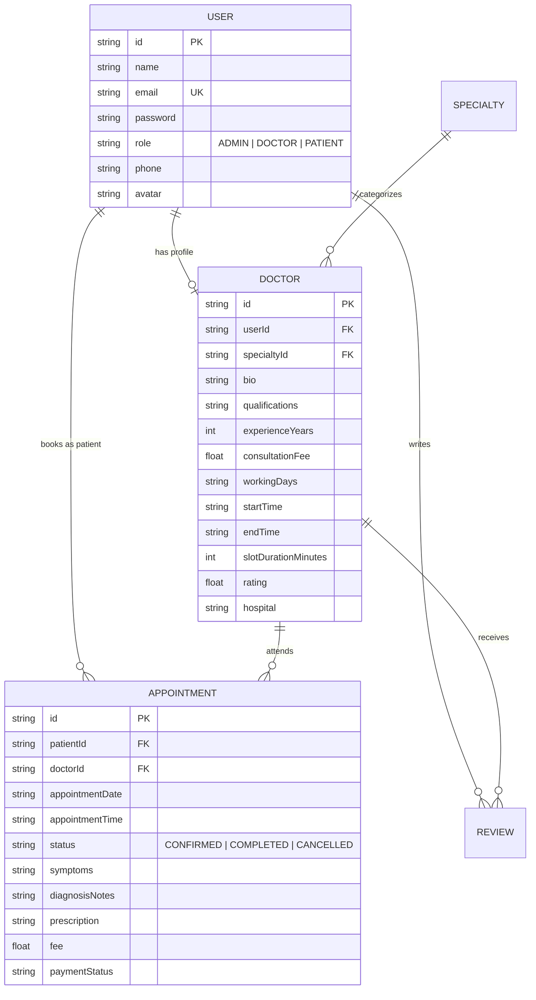

# CareSync 🏥 | Modern Clinic & Doctor Appointment Management Platform

[](https://react.dev/)
[](https://nodejs.org/)
[](https://expressjs.com/)
[](https://tailwindcss.com/)
[](https://www.prisma.io/)
[](https://jwt.io/)

CareSync is a full-stack, enterprise-grade healthcare management application designed to streamline clinic workflows, automate patient appointments through dynamic slot scheduling algorithms, issue digital prescriptions, and deliver executive-level clinical analytics.

---

## 🌟 Key Features

### 🧑‍💼 Patient Portal
- **Specialist Directory & Search:** Real-time filtering across medical disciplines (Cardiology, Dermatology, Neurology, Pediatrics, etc.).
- **Dynamic Slot Booking Engine:** Intelligent slot generator calculates 30-minute consultation slots based on doctor working hours and automatically locks booked intervals.
- **Appointment Management:** Real-time tracking of upcoming/completed visits with cancellation lifecycle.
- **Digital E-Prescriptions:** Direct access to medical records, diagnosis summaries, and doctor prescriptions.
- **Doctor Reviews & Ratings:** Verified patient feedback and star rating system.

### 👨‍⚕️ Doctor Clinical Hub
- **Queue & Daily Schedule:** Overview of scheduled patient appointments and contact logs.
- **Consultation Management:** Update consultation status (`CONFIRMED`, `COMPLETED`, `CANCELLED`).
- **E-Prescriptions:** Issue structured digital prescriptions and clinical diagnosis notes directly to patient records.

### 👑 Executive Admin & Analytics Portal
- **Clinic KPIs:** Live tracking of Total Patients, Active Doctors, Appointment Volume, and Clinic Revenue.
- **Interactive Data Visualizations:** Monthly revenue growth trends and department load distributions powered by Recharts.
- **Doctor Onboarding:** Register and configure medical consultants with custom consultation parameters and working hours.

---

## 🔐 Demo Accounts

Pre-configured accounts for testing different role permissions:

| Role | Email | Password | Access Capabilities |
| :--- | :--- | :--- | :--- |
| **👑 Admin** | `admin@caresync.com` | `admin123` | Executive KPI Dashboard, Revenue Charts, Doctor Onboarding |
| **👨‍⚕️ Doctor** | `dr.sarah@caresync.com` | `doctor123` | Patient Queue, Consultation Notes, E-Prescriptions |
| **🧑‍💼 Patient** | `kasun@test.com` | `patient123` | Doctor Search, Slot Booking, Prescription Viewer |

> 💡 **Tip:** The login page also features **1-Click Demo Buttons** to automatically populate credentials for quick role switching.

---

## 🏗️ System Architecture & Entity Relationships



---

## 🚀 Getting Started

### Prerequisites
- **Node.js**: v18.0.0 or higher
- **Git**

### Installation & Setup

1. **Clone the repository:**
   ```bash
   git clone https://github.com/NirashaWijesinghe/caresync-clinic-system.git
   cd caresync-clinic-system
   ```

2. **Backend Setup:**
   ```bash
   cd server
   npm install
   npm run db:setup      # Creates database & seeds initial demo records
   npm start             # Runs API server on http://localhost:5000
   ```

3. **Frontend Setup (in a new terminal):**
   ```bash
   cd client
   npm install
   npm run dev           # Runs client on http://localhost:5173
   ```

4. **Access the application:**
   Open `http://localhost:5173` in your browser.

---

## ⚙️ Environment Variables

### Server (`server/.env`)
```env
PORT=5000
DATABASE_URL="file:./dev.db"
JWT_SECRET="your-secure-jwt-secret-key"
NODE_ENV="development"
```

### Client (`client/.env`)
```env
VITE_API_URL="http://localhost:5000/api"
```

---

## 📜 License

This project is licensed under the [MIT License](LICENSE).