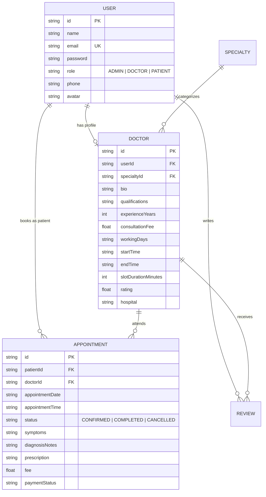

# CareSync 🏥 | Modern Clinic & Doctor Appointment Management Platform

[](https://react.dev/)
[](https://nodejs.org/)
[](https://expressjs.com/)
[](https://tailwindcss.com/)
[](https://www.prisma.io/)
[](https://jwt.io/)

CareSync is a full-stack, enterprise-grade healthcare management application connecting patients with certified medical specialists, managing doctor schedules through dynamic time-slot calculation algorithms, issuing digital prescriptions, and providing executive clinic analytics.

---

## 🌟 Key Highlights & Feature Matrix

### 1. 🧑‍💼 Patient Experience
- **Specialist Directory & Instant Search:** Filter doctors across clinical disciplines (Cardiology, Dermatology, Neurology, Pediatrics, etc.) with real-time keyword search.
- **Dynamic Slot Booking Engine:** Intelligent slot generator calculates 30-minute consultation slots based on doctor working hours and automatically locks already booked intervals.
- **Consultation Dashboard:** Real-time tracking of upcoming/completed visits with cancellation lifecycle.
- **Digital E-Prescriptions & Clinical Notes:** Direct access to medical records, diagnosis summaries, and doctor prescriptions.
- **Doctor Reviews & Ratings:** Verified patient feedback and star rating system.

### 2. 👨‍⚕️ Doctor Clinical Hub
- **Patient Queue & Daily Schedule:** Overview of scheduled appointments and patient contact logs.
- **Consultation Lifecycle Management:** Seamlessly mark appointments as `CONFIRMED` or `COMPLETED`.
- **E-Prescription Management:** Input clinical diagnosis notes and structured medication dosages.

### 3. 👑 Executive Admin & Analytics Portal
- **Real-Time KPIs:** Live tracking of Total Patients, Active Doctors, Appointment Volume, and Clinic Gross Revenue (LKR).
- **Interactive Data Visualizations (Recharts):** Monthly revenue growth area chart and department-wise specialist distribution bar chart.
- **Doctor Onboarding Engine:** Register and activate new medical consultants with custom schedule parameters.

---

## 🔐 Pre-Seeded Demo Reviewer Accounts

For portfolio reviewers and technical interviewers:

| Role | Email | Password | Access Capabilities |
| :--- | :--- | :--- | :--- |
| **👑 Admin** | `admin@caresync.com` | `admin123` | Executive KPI Dashboard, Revenue Charts, Doctor Management |
| **👨‍⚕️ Doctor** | `dr.sarah@caresync.com` | `doctor123` | Patient Queue, Consultation Notes, E-Prescriptions |
| **🧑‍💼 Patient** | `kasun@test.com` | `patient123` | Doctor Search, Slot Booking, Prescription Viewer |

> 💡 **Tip:** The login page also features **1-Click Demo Buttons** to automatically populate credentials for quick role switching.

---

## 🏗️ Architecture & Database Design



---

## 🚀 Getting Started Locally

### Prerequisites
- **Node.js**: v18+ (tested on Node v20/v22)
- **Git**

### 1. Clone the repository
```bash
git clone https://github.com/YOUR_USERNAME/caresync.git
cd caresync
```

### 2. Setup and Start Backend Server
```bash
cd server
npm install
npm run db:setup      # Creates local SQLite database & seeds sample data
npm start             # Runs API server on http://localhost:5000
```

### 3. Setup and Start Frontend Client (in a new terminal)
```bash
cd client
npm install
npm run dev           # Runs React client on http://localhost:5173
```

Open **`http://localhost:5173`** in your browser to view the application.

---

## 🌐 Free Cloud Deployment Guide

### Database & Backend Deployment (Render.com / Railway)
1. Push this project to GitHub.
2. Create a free PostgreSQL database on [Supabase.com](https://supabase.com) or [Neon.tech](https://neon.tech).
3. On **Render.com**, create a **New Web Service** pointing to `/server`.
4. Set Environment Variables:
   - `DATABASE_URL`: Your Supabase connection string.
   - `JWT_SECRET`: A secure random string.
   - `PORT`: `5000`
5. Build command: `npm install && npx prisma generate && npx prisma db push && node prisma/seed.js`
6. Start command: `node src/server.js`

### Frontend Deployment (Vercel)
1. On **Vercel.com**, import the repository and select `/client` as the Root Directory.
2. Set Environment Variable:
   - `VITE_API_URL`: `https://your-backend.onrender.com/api`
3. Click **Deploy**.

---

## 📄 Recommended CV Bullet Points

```text
CareSync | Full-Stack Healthcare & Doctor Appointment Management System
Tech Stack: React, Node.js, Express, Tailwind CSS, Prisma ORM, JWT, Recharts
Live Demo: [your-live-link] | GitHub: [your-github-repo-link]
• Architected a production-ready clinic management system with multi-tier Role-Based Access Control (Admin, Doctor, Patient) using JWT authentication and BCrypt.
• Implemented a dynamic time-slot scheduling algorithm supporting flexible doctor working hours, conflict avoidance, and real-time consultation bookings.
• Built interactive analytics dashboards using Recharts to visualize monthly revenue growth, department load, and patient appointment metrics.
• Engineered digital medical records workflows enabling consultants to issue structured E-prescriptions and clinical diagnosis summaries.
```